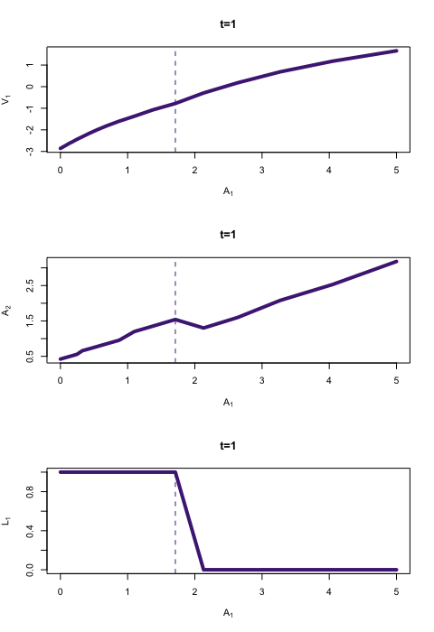
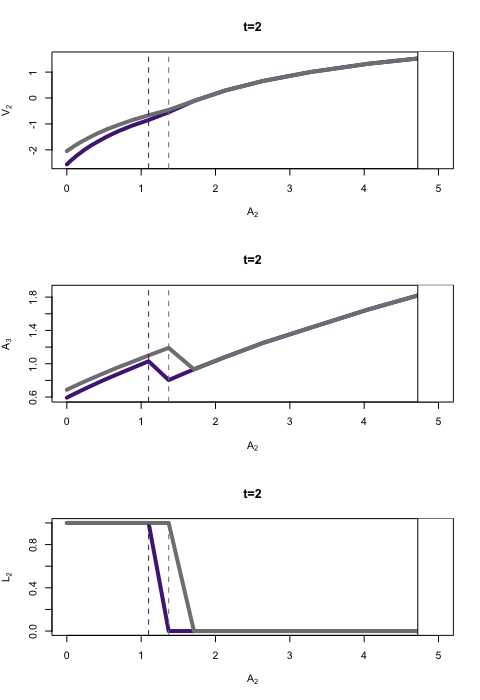

```{r setup, include=FALSE}
knitr::opts_chunk$set(echo = FALSE)
load("final.RData")
```

The code and the report can be found in my [github repo](https://github.com/hans-mtz/AdvMetrics)

## Q1 Borrowing constraint

Taking FOC of the problem and substituting, we get that the borrowing constraint is the following:

$$\begin{aligned}
A_2 &\ge -\frac{I_2}{(1+r)} \\
A_1 &\ge -\frac{I_1}{(1+r)}-\frac{I_2}{(1+r)^2}
\end{aligned}$$

This makes sense. It implies that agents can't borrow more than their remaining discounted income.

## Q2-Q4 Coding and testing  routines

Figure 1 shows the results for the value function, savings, and labor on the grid of assets for periods 1 and 2, respectively.

We can see there's that for a certain level of initial assets $A_1$, agents choose not to work in period one. This is reflected in the value function and the savings. In period two, we observe that individuals who chose to work on period one, tend to stop working for a higher level of assets than individuals who chose not to work on period one. The value of the objective function was 0.081252.

<!--   -->

```{r, out.width="50%", fig.show='hold', fig.cap="Value function, savings and labour on the grid of assets for periods 1 and 2, respectively."}
knitr::include_graphics(c("t1w.png","t2w.png"))
```


## Q5-Q6 Estimating by indirect inference and counterfactuals

I used MPI to parallelize the indirect inference routine. The idea is to distribute the simulation of the individuals equally among the available CPUs and have just one CPU returning the value of the objective function to the optimizer. This greatly reduced the estimating time, but it took me longer to code it. Anyways, it took approximately 36.5 minutes for the optimization routine to converge (twice), one after another one, for 1000 individuals. Figure 2 displays the resulting unemployment rate and the asset distribution for the base case.

```{r}
knitr::kable(iivt)
```

```{r, out.width=c("100%","50%"), fig.show='hold', fig.cap="Asset distribution and unemployment rate for base case"}
knitr::include_graphics(c("asdist_0.png"))
knitr::include_graphics(c("emp_0.png"))
```

Figures 3 and 4, summarize the findings after running the counterfactuals using the estimated parameters. In general, unemployment increases when the minimum income increases, and the distribution of assets widens when the interest rate increases. In other words, more people save more.

```{r, out.width='50%', fig.show='hold', fig.cap="Unemployment rates for different counterfactual scenarios."}
knitr::include_graphics(c("emp_c1.png","emp_c2.png"))
```

```{r, out.width='100%', fig.show='hold', fig.cap="Asset distribution for different counterfactual scenarios."}
knitr::include_graphics(c("asdist_ca2.png","asdist_ca3.png"))
```

\newpage

## Conclusions

The heterogeneous agents’ models are not that scary after all. Of course, this is a short problem where people only live for three periods. I can see how the problem can scale up if we have infinite living agents and add more dimensions to the heterogeneity of agents. It is also a partial equilibrium model, there are no firms, prices are given.

Concerning the optimization part, it is tricky and difficult to get to the right parameters. I can anticipate that it can be very difficult to choose which results to use in a real research problem. In the exercises, we knew what were the true parameters. We can tune the initial guesses, and maybe calibrate by trial-and-error the random seed. My estimation performed better for instance, once I plugged the true parameters and then tried to reduce the resulting value of the objective function. In short, we knew exactly what the parameters should look like. In the field, we could let ourselves go with our own preconceived biases.


